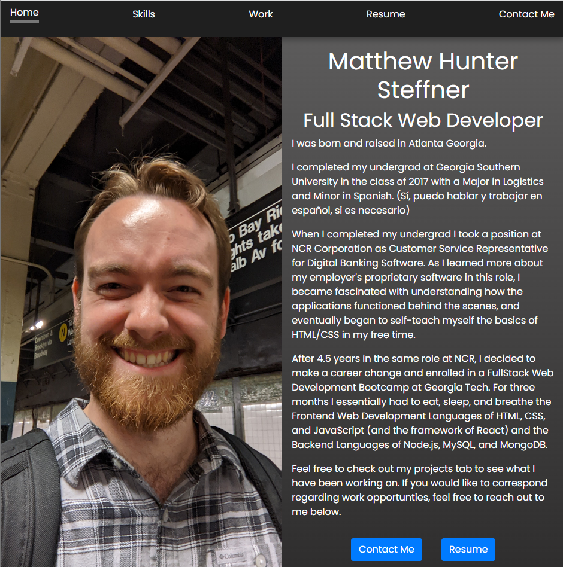

# Personal Portfolio with React

## Table of Contents

- [Description](#description)
- [Installation](#installation)
- [Usage](#usage)
- [Contribution](#contribution)
- [Contact](#contact)

## Description

This is a portfolio that I created to show to future employers. It has information about me, my skills, the projects I have been working on, my resume, and a contact me form. It is a single page application designed entirely with React. The contact me for is powered by formsubmit.co. The Routes are powered by react-router-dom

## Installation

This program requires Node.js and NPM. Once these are installed, please run:

```
npm i
```
To start the React Server you must run:
```
npm start
```
To  deploy changes made to website you must run:
```
npm run deploy
```

## Usage

This can be used as a portfolio template


## Screenshot



## Contribution

This is my personal portofolio and is not available for contribution.

## Questions

Feel free to reach out to me directly if you have any questions or concerns. You can reach me via email, or check out my github profile below.

Email: huntersteffner@gmail.com

GitHub: [huntersteffner](https://github.com/huntersteffner/)


